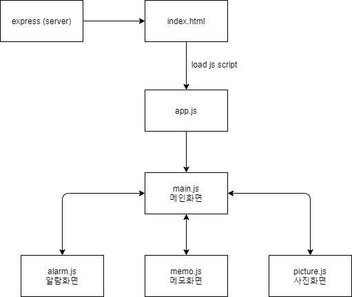
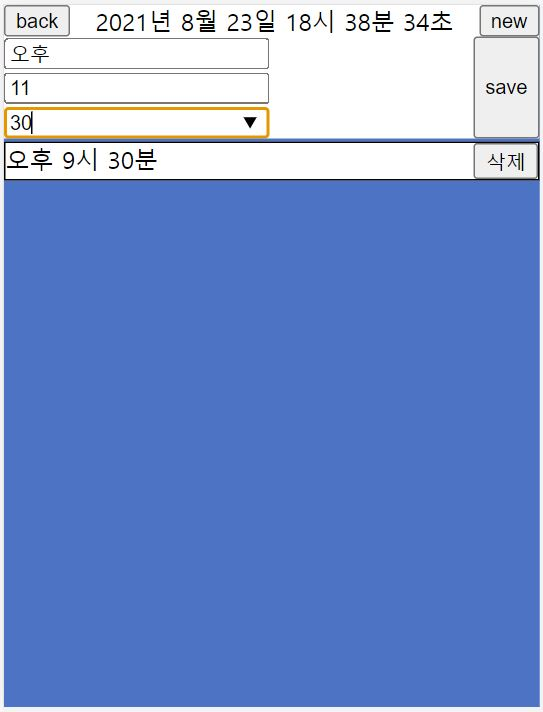
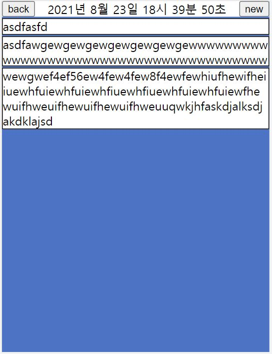
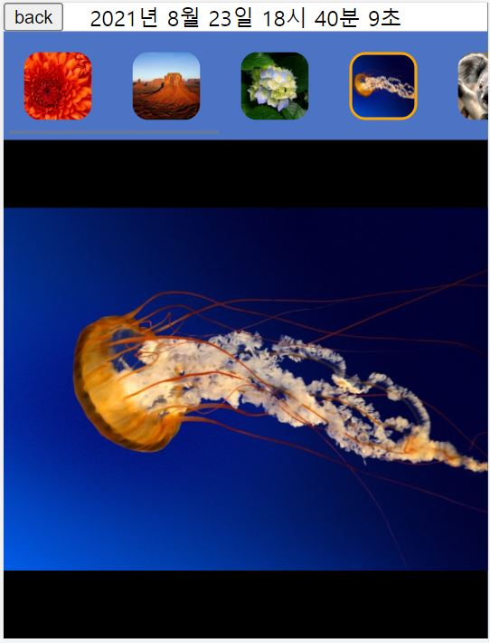

# 11st 프론트엔드 과제

## 실행 방법

저장소 clone 후

```
npm install

npm start
```

## 모듈 구조


express를 이용하여 서버를 실행시켜주었습니다.
최초에 index.html을 실행시켜주고 index.html 안에서 app.js파일을 script태그를 이용해서 불러들입니다. 그렇게 되면 body에 있는 App클래스를 가진 div를 통해서 유동적으로 화면을 변경하게 됩니다. 먼저 명세서에 있었던 어플들을 볼 수 있는 main화면, 여기서 main화면에 있는 어플들을 클릭해서 각 alarm, memo, picture화면으로 넘어갈 수 있고 좌측 상단 back버튼을 눌러 다시 main화면으로 돌아갈 수 있는 구조로 제작하였습니다.

## 참고사항

- 알람의 경우 localStorage에 저장해서 다시 나중에 불러올수록 하는 구조이기 때문에 1)알람을 등록할 때, 2)Reload후 main페이지에서 다시 설정할 때 이 두가지의 경우에 alarm데이터를 이용해서 setTimeout을 등록해주었습니다. 그래서 이 두가지의 경우는 페이지가 달라서 통합적으로 상태를 관리하는 곳이 필요했기 때문에 timer.js라는 파일에 싱글톤 객체를 선언해서 불러와서 사용할 수 있도록 구현하였습니다.
- 상태표시줄의 시간은 계속 변하고 모든 페이지에서 사용하기 때문에 utils/day.js라는 파일로 따로 빼서 어디서든 사용할 수 있도록 하였습니다.

## 각 화면 이미지

### Alarm



### Memo



### Picture


